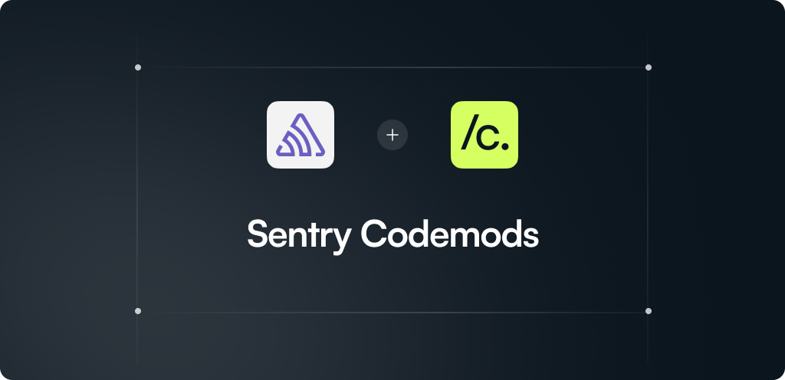

Codemods to help adopt new Sentry features and handle breaking changes safely. Built in collaboration with [Codemod](https://codemod.com/) ([GitHub](https://github.com/codemod)).

## Quickstart

Caution: These scripts change source code. Commit or stash changes before running.

Run a codemod from the registry:

```bash
npx codemod@latest sentry/v8/<codemod-name>
```

## Available Codemods

- See `codemods/` for available transformations.
- When published, v8 codemods can be invoked via `npx codemod@latest sentry/v8/<codemod-name>`.

### Sentry v8

- `sentry/v8/removal-of-addGlobalEventProcessor`
- `sentry/v8/removal-of-void-from-transport-return-types`
- `sentry/v8/removal-Sentry-configureScope-method`
- `sentry/v8/removal-Severity-Enum`
- `sentry/v8/remove-replay-package-and-update-integration`
- `sentry/v8/replace-span-status-from-http-code`

## Repository Structure

```
codemods/
  <codemod-name>/
    meta.json        // name, summary, safety level, tags, options
    transform.ts     // the migration entrypoint (ESM, TypeScript)
    tests/           // fixture-based tests (optional)
    fixtures/        // input/output samples for tests (optional)
utils/
  index.ts           // shared helpers reused by codemods
```

## Conventions

- ESM, TypeScript, Node 20+.
- Keep transforms idempotent and conservative by default.
- Expose user-tunable options with sensible defaults.
- Add `meta.json` with: `name`, `summary`, `safety`, `tags`, `options`.

## Maintainers: Testing

Run fixture tests for v8 codemods:

```bash
npm run test:fixtures
```

## Contributing

Contributions welcome. Please open an issue to discuss proposed codemods or improvements.
This project is maintained by Sentry with collaboration from [Codemod](https://codemod.com/) ([GitHub](https://github.com/codemod)).

## License

MIT
