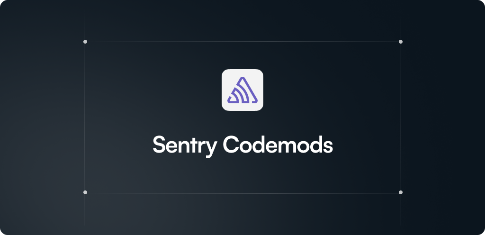

> **REMOEV THIS SECTION ONCE THE REPO IS SET UP.**
> 
> Sentry team: This repo comes with a one-time setup guide, utilities, and a GitHub Action to help you and your community build and publish codemods with ease.
> ## One-time Setup
> NOTE: You need repo creation privileges in your org and permission to install GitHub apps on repos. If you don’t, you can request access from your org admin during setup.
> 1. Use this template and create a codemods repo in your org.
> 2. Sign up at [Codemod](https://app.codemod.com) with your GitHub account.  
> 3. Install the Codemod GitHub app:
>    1. Click your profile photo (top left) and select "Add organization"
>    2. Pick GitHub, choose your org and the new codemods repo. This installs the Codemod GitHub App and reserves a **scope** with your org name. 
>     - Benefit: Only members of the `getsentry` org can publish codemods under `@getsentry`.
>     - **Important**: In `codemod.yaml`, the name must start with your `@scope`, otherwise it won’t appear when users filter for `@getsentry` in the registry.
> 4. In Codemod, switch from personal account to org account and generate a [Codemod API key](https://app.codemod.com/api-keys).
> 5. In your GitHub repo: **Settings → Secrets & variables → actions**  
>    1. Create a repository secret.    
>      - Name: `CODEMOD_API_KEY`  
>      - Value: the key from step 1.  
>
> ✅ Done! Now, after a codemod PR is merged, you can trigger a GitHub Action to auto-publish it to the [Codemod Registry](https://app.codemod.com/registry) under your org scope. See [Node.js codemods](https://codemod.link/nodejs-official) for an example.
> 
> To build a codemod, clone your new repo locally and use [Codemod MCP](https://docs.codemod.com/more-resources/codemod-mcp) in your IDE to replace the boilerplate with a codemod generated using AI. You can also run `npx codemod@latest init` for the initial scaffolding, or use [Codemod Studio](https://codemod.studio) for its live codemod runner and AST viewer.
---


Sentry codemods to help users adopt new features and handle breaking changes with ease.

Community contributions are welcome and appreciated! Check open issues for codemods to build, or open a new one if something’s missing. See the [contribution guide](./CONTRIBUTING.md) for details.

## Running codemods
> [!CAUTION]
> Caution: Codemods modify code! Run them only on Git-tracked files, and commit or stash changes first.
### From the registry 
Recommended for better UX, downloads the package from [registry](https://app.codemod.com/registry).

```bash
npx codemod@latest <codemod-name>
```
For example: 
```
npx codemod@latest flatten-experiments-config
```
### From the source 
```bash
npx codemod workflow run -w /path/to/folder/containing/workflow.yaml
```

> [!NOTE]
> By default, codemods run in the current folder. Add `-t /target/path` to your command to change it.

See the [Codemod docs](https://go.codemod.com/cli-docs) for all CLI commands and options.
  

## License

MIT
